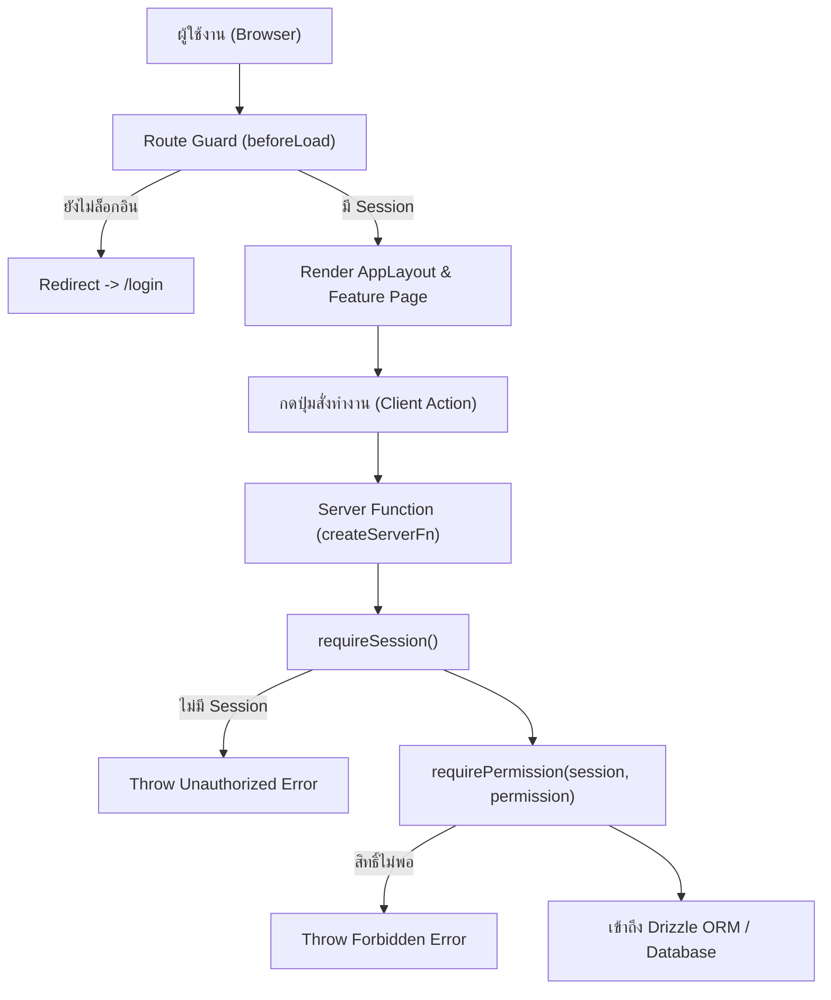

# คู่มือ Authentication และ Role-Based Access Control (RBAC)

คู่มือฉบับนี้อธิบายระบบการยืนยันตัวตน (Authentication) และการจัดการสิทธิ์การเข้าถึง (Authorization/RBAC) ในโปรเจกต์ `jobs-analysis` ซึ่งสร้างขึ้นบน **Better Auth** และเชื่อมต่อกับ **PostgreSQL + Drizzle ORM**

---

## 1. ภาพรวมสถาปัตยกรรมความปลอดภัย

ระบบความปลอดภัยในโปรเจกต์นี้ทำงานร่วมกัน 3 เลเยอร์:

1. **Client Layer:** ตรวจสอบสิทธิ์เบื้องต้นผ่าน `authClient.useSession()` เพื่อซ่อนหรือแสดงผล UI (เช่น ซ่อนปุ่ม "New Project" สำหรับ Member)
2. **Route Guard Layer:** ดักจับการเข้าถึง URL ใน `beforeLoad` ของไฟล์ route เพื่อสั่ง redirect หากไม่มี session
3. **Server Layer (Source of Truth):** ตรวจสอบ session และสิทธิ์จริงใน `*.server.ts` ผ่าน `requireSession()` และ `requirePermission()` ทุกครั้งก่อนเข้าถึงข้อมูล โดย permission override มาจาก `role_permissions` และ default catalog อยู่ที่ `src/lib/rbac.ts`



---

## 2. บทบาทผู้ใช้ (Roles) และตาราง Matrix สิทธิ์

ในโปรเจกต์มี built-in role 3 ระดับใน [`src/lib/roles.ts`](file:///Users/sh0ckpro/Works/Freelance/Bun/jobs-analysis/src/lib/roles.ts) และเก็บ role catalog ทั้ง built-in/custom ไว้ใน `access_roles`:

- **Admin (`admin`):** ผู้ดูแลระบบสูงสุด จัดการผู้ใช้/แผนก แก้ไขโปรเจกต์และเวลาทำงานของทุกคนได้
- **Manager (`manager`):** ผู้จัดการโปรเจกต์ สร้างโปรเจกต์ได้ และจัดการงาน/ชั่วโมงทำงานเฉพาะในโปรเจกต์ที่ตนเองเป็นเจ้าของ (Owner)
- **Member (`member`):** สมาชิกทีมทั่วไป บันทึกเวลา (Log Work) และดูชั่วโมงทำงานเฉพาะของตัวเอง

| ความสามารถ                                                    |     Admin      |             Manager             |               Member                |
| :------------------------------------------------------------ | :------------: | :-----------------------------: | :---------------------------------: |
| ดูข้อมูล Dashboard และโปรเจกต์ทั้งหมด                         |       ✅       |               ✅                |                 ✅                  |
| สร้างโปรเจกต์ใหม่                                             |       ✅       |               ✅                |                 ❌                  |
| แก้ไข / Archive โปรเจกต์                                      | ✅ ทุกโปรเจกต์ | ✅ เฉพาะโปรเจกต์ที่ตนเป็น Owner |                 ❌                  |
| สร้าง Issue ในโปรเจกต์                                        |       ✅       |               ✅                |                 ✅                  |
| แก้ไข / ลบ Issue                                              |  ✅ ทุก issue  |       ✅ ในโปรเจกต์ตนเอง        | ✅ เฉพาะ issue ที่ตนสร้าง/รับผิดชอบ |
| Assign งานข้ามบุคคล                                           |  ✅ ใครก็ได้   |           ✅ ใครก็ได้           |   เฉพาะตนเองหรือคนในแผนกเดียวกัน    |
| Log Work / Start Timer ให้ตนเอง                               |       ✅       |               ✅                |                 ✅                  |
| แก้ไขหรือลบ Worklog ของผู้อื่น                                |       ✅       |               ❌                |                 ❌                  |
| ดูรายงานชั่วโมงทำงานภาพรวม                                    |    ✅ ทุกคน    |    ✅ ลูกทีมในโปรเจกต์ตนเอง     |          ✅ เฉพาะของตนเอง           |
| จัดการผู้ใช้ แผนก และ role (`/users`, `/settings?tab=access`) |       ✅       |               ❌                |                 ❌                  |

ตารางข้างต้นคือค่าเริ่มต้นของ built-in roles เท่านั้น Admin สามารถสร้าง custom role และปรับ permission งานได้จาก `/settings?tab=access&section=roles` ระบบจะบันทึก role ใน `access_roles` และ override แบบ `role + permission` ลง `role_permissions` พร้อมตรวจซ้ำที่ server ทุกครั้ง ส่วน permission ควบคุม access ของ Admin จะถูกล็อกไว้เพื่อป้องกันการตัดสิทธิ์ตัวเองจนเข้าแผงจัดการไม่ได้ Permission ใหม่ต้องประกาศใน `src/lib/rbac.ts` และมี server guard รองรับก่อนจึงจะเพิ่มเข้า catalog ได้

---

## 3. การตั้งค่า Better Auth ฝั่ง Server ([`auth.server.ts`](file:///Users/sh0ckpro/Works/Freelance/Bun/jobs-analysis/src/features/auth/auth.server.ts))

ระบบใช้ `better-auth/minimal` ร่วมกับ `drizzleAdapter` และปลั๊กอิน `tanstackStartCookies`:

```tsx
import { betterAuth } from 'better-auth/minimal'
import { drizzleAdapter } from 'better-auth/adapters/drizzle'
import { tanstackStartCookies } from 'better-auth/tanstack-start'
import { Role } from '@/lib/roles'
import { getDb } from '@/db/client.server'
import * as schema from '@/db/schema'

export const auth = betterAuth({
  baseURL: resolveBaseURL(),
  database: drizzleAdapter(getDb()!, {
    provider: 'pg',
    schema,
  }),
  emailAndPassword: {
    enabled: true,
  },
  user: {
    additionalFields: {
      role: {
        type: 'string',
        defaultValue: Role.Member,
        input: false, // ห้าม client กำหนด role เองตอน signup
      },
      departmentId: {
        type: 'string',
        input: false, // กำหนดได้โดย admin เท่านั้น
      },
    },
  },
  plugins: [tanstackStartCookies()],
})
```

### จุดสำคัญด้านความปลอดภัย

- **`input: false`:** ป้องกันไม่ให้ผู้ใช้ส่ง field `role` หรือ `departmentId` มาใน payload ตอน Sign up เพื่อเลื่อนขั้นสิทธิ์ตัวเอง บัญชีที่สมัครใหม่จะได้ role `member` เสมอ
- **`tanstackStartCookies()`:** จัดการ Session Cookie ให้เข้ากับ lifecycle ของ TanStack Start อัตโนมัติ

---

## 4. ตัวดักและตรวจสิทธิ์ใน Server Functions

ในไฟล์ `*.server.ts` ทุกไฟล์ที่มีการเข้าถึงข้อมูล จะต้องเรียกใช้ Guard เหล่านี้:

### 1. `requireSession()`

ตรวจสอบว่า request ปัจจุบันมี session cookie ที่ยังไม่หมดอายุหรือไม่:

```tsx
export async function requireSession(): Promise<AuthSession> {
  const session = await getAuthSession()
  if (!session) throw new Error('Unauthorized')
  return session
}
```

### 2. `requireRole(session, allowedRoles)`

ตรวจสอบว่าผู้ใช้มีบทบาทตรงตามที่กำหนดไว้หรือไม่:

```tsx
export function requireRole(
  session: AuthSession,
  roles: readonly UserRole[],
): void {
  const role = session.user.role
  if (!role || !roles.includes(role as UserRole)) {
    throw new Error(`Forbidden — requires role: ${roles.join(' or ')}`)
  }
}
```

### 3. `requirePermission(session, permission)`

ใช้ตรวจสิทธิ์ที่แก้ได้จาก RBAC matrix โดยอ่าน override ในฐานข้อมูลก่อน และ fallback เป็น default ของ role เมื่อยังไม่มี override:

```tsx
import { requirePermission } from '@/features/auth/auth.server'
import { Permissions } from '@/lib/rbac'

const session = await requireSession()
await requirePermission(session, Permissions.ProjectsManage)
```

### 4. ตรวจสอบความเป็นเจ้าของ (Resource Ownership Check)

สำหรับกรณีที่ Manager จัดการได้เฉพาะงานของตัวเอง:

```tsx
async function assertProjectManageAccess(
  session: AuthSession,
  projectId: number,
) {
  await requirePermission(session, Permissions.ProjectsManage)

  // ถ้าเป็น Manager ต้องเป็นเจ้าของโปรเจกต์นี้เท่านั้น
  if (session.user.role === Role.Manager) {
    const db = getDb()!
    const [row] = await db
      .select({ ownerId: projects.ownerId })
      .from(projects)
      .where(eq(projects.id, projectId))
      .limit(1)

    if (!row || row.ownerId !== session.user.id) {
      throw new Error('Forbidden — not the project owner')
    }
  }
}
```

---

## 5. การป้องกันหน้าฝั่ง Router (`beforeLoad`)

ในไฟล์ [`src/routes/_app/route.tsx`](file:///Users/sh0ckpro/Works/Freelance/Bun/jobs-analysis/src/routes/_app/route.tsx) มีการดักจับ session ก่อนโหลดหน้าใน layout หลัก:

```tsx
export const Route = createFileRoute('/_app')({
  beforeLoad: async () => {
    const session = await getSession()
    if (!session) {
      throw redirect({ to: '/login' })
    }
  },
  component: AppLayout,
})
```

และสำหรับหน้าเฉพาะ Admin เช่น [`src/routes/_app/users.tsx`](file:///Users/sh0ckpro/Works/Freelance/Bun/jobs-analysis/src/routes/_app/users.tsx):

```tsx
export const Route = createFileRoute('/_app/users')({
  beforeLoad: async () => {
    const session = await getSession()
    if (!session || session.user.role !== 'admin') {
      throw redirect({ to: '/' })
    }
  },
  component: UsersPage,
})
```

---

## 6. การใช้งาน Client-side Authentication Hook

ฝั่ง React ใช้ `authClient` จาก [`src/features/auth/auth-client.ts`](file:///Users/sh0ckpro/Works/Freelance/Bun/jobs-analysis/src/features/auth/auth-client.ts):

```tsx
import { authClient } from '@/features/auth/auth-client'
import { Role } from '@/lib/roles'

export function UserNav() {
  const { data: session, isPending } = authClient.useSession()

  if (isPending) return null
  if (!session) return null

  const isAdmin = session.user.role === Role.Admin

  return (
    <div>
      <p>
        {session.user.name} ({session.user.role})
      </p>
      {isAdmin && <button>แผงควบคุม Admin</button>}
      <button onClick={() => authClient.signOut()}>ออกจากระบบ</button>
    </div>
  )
}
```

---

## 7. Troubleshooting ด้าน Auth

### 1. ล็อกอินผ่านแล้ว แต่รีเฟรชหน้าแล้วกลับไปหน้า Login เหมือนเดิม

- **สาเหตุ:** `BETTER_AUTH_URL` ในไฟล์ `.env` ไม่ตรงกับ URL ที่เปิดในเบราว์เซอร์ (เช่น ใน `.env` ตั้ง `localhost:3000` แต่เปิดด้วย `127.0.0.1:3000`)
- **วิธีแก้:** ตั้งค่า `BETTER_AUTH_URL` ให้ตรงกับ Host ที่เปิดใช้งาน หรือพึ่งพา Dynamic Host Resolver ที่ระบบเซ็ตไว้

### 2. เกิด Error `DATABASE_URL is not set` ตอนเซิร์ฟเวอร์เริ่มทำงาน

- **สาเหตุ:** Better Auth ต้องเชื่อมต่อกับฐานข้อมูล PostgreSQL เสมอเพื่ออ่านและบันทึก token
- **วิธีแก้:** ตรวจสอบว่ามีไฟล์ `.env` พร้อมค่า `DATABASE_URL` และรัน Docker Postgres แล้วหรือยัง
