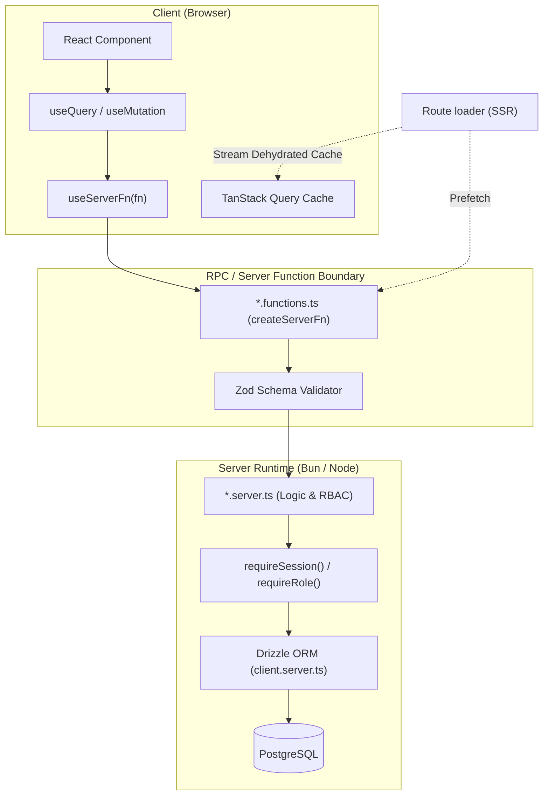

# คู่มือ Data Fetching, Server Functions และ API ใน TanStack Start

คู่มือฉบับนี้อธิบายระบบการดึงและจัดการข้อมูล (Data Fetching), Server Functions (RPC) และการสร้าง API Endpoint ในสถาปัตยกรรมของ TanStack Start บนโปรเจกต์ `jobs-analysis` แบบละเอียด

---

## 1. ภาพรวมและ Mental Model ของ Data Flow

ในเว็บแอปยุคก่อน เรามักต้องสร้าง REST API (`/api/projects`) แยกต่างหาก แล้วเขียน `fetch` หรือ Axios ฝั่งหน้าบ้านเพื่อดึงข้อมูล แต่ใน **TanStack Start** เรามี **Server Functions (`createServerFn`)** ซึ่งทำหน้าที่เป็น Remote Procedure Call (RPC) แบบ Type-Safe 100%:

- **เรียกใช้ได้เหมือนฟังก์ชันธรรมดา:** ฝั่ง client เรียกใช้ฟังก์ชัน server เหมือนฟังก์ชัน TypeScript ทั่วไป
- **คอมไพเลอร์จัดการ HTTP ให้อัตโนมัติ:** ตอน build ระบบจะแปลงการเรียกนี้เป็น HTTP Request (POST/GET) โดยเราไม่ต้องเขียน route API หรือ URL path เอง
- **ทำงานร่วมกับ TanStack Query:** นำ server function ไปครอบด้วย `useQuery` และ `useMutation` เพื่อจัดการ cache, deduplication, และ background refetching
- **SSR Hydration แบบ Zero Waterfall:** ข้อมูลถูก prefetch ฝั่ง server ใน `loader` จากนั้นส่งลง HTML stream ให้ client hydrate ทันทีโดยไม่ต้องโหลดข้อมูลซ้ำ



---

## 2. สถาปัตยกรรมแบ่ง 3 เลเยอร์ (Three-Tier Boundary)

เพื่อไม่ให้โค้ดฝั่ง server รั่วไหลไปยัง bundle ฝั่ง client โปรเจกต์นี้กำหนดโครงสร้างของแต่ละฟีเจอร์แยกเป็น 3 เลเยอร์ตายตัว:

```text
src/features/projects/
├── projects.schema.ts      # 1. Zod schemas และ shared types (Client + Server ใช้ร่วมกัน)
├── projects.server.ts      # 2. Database queries, business logic, RBAC (Server เท่านั้น)
├── projects.functions.ts   # 3. จุดเชื่อมต่อ RPC ด้วย createServerFn (Client ปลอดภัยที่จะ import)
└── projects-page.tsx       # 4. React component ฝั่ง UI
```

### หน้าที่และข้อจำกัดของแต่ละเลเยอร์

| ไฟล์             | เลเยอร์               | รันที่ไหน       | อนุญาตให้อิมพอร์ตอะไร                          | ข้อห้ามเด็ดขาด                                                 |
| :--------------- | :-------------------- | :-------------- | :--------------------------------------------- | :------------------------------------------------------------- |
| `*.schema.ts`    | Validation & Types    | ทั้งสองฝั่ง     | `zod`                                          | ห้าม import DB client หรือโค้ดที่มี side-effect                |
| `*.server.ts`    | Server Implementation | Server เท่านั้น | Drizzle ORM, DB client, Secrets                | **ห้าม import เข้าไฟล์ route หรือ component ฝั่ง client**      |
| `*.functions.ts` | RPC Boundary          | สะพานเชื่อม     | `createServerFn`, `*.schema.ts`, `*.server.ts` | ห้ามใส่ direct DB query ลงในไฟล์นี้ ให้เรียกผ่าน `*.server.ts` |

---

## 3. การสร้าง Server Functions (`createServerFn`)

Server Functions ประกาศในไฟล์ `*.functions.ts` โดยใช้ `createServerFn`:

```tsx
import { createServerFn } from '@tanstack/react-start'
import { createProjectRecord, getProjectsRecord } from './projects.server'
import { createProjectInputSchema } from './projects.schema'

// 1. GET Function (ดึงข้อมูล)
export const getProjects = createServerFn({ method: 'GET' }).handler(() =>
  getProjectsRecord(),
)

// 2. POST Function (ส่งข้อมูล / Mutation พร้อม Validation)
export const createProject = createServerFn({ method: 'POST' })
  .validator(createProjectInputSchema)
  .handler(({ data }) => createProjectRecord(data))
```

### สิ่งที่ควรรู้เกี่ยวกับ `createServerFn`

1. **`method: 'GET'` vs `'POST'`:**
   - ใช้ `GET` สำหรับการอ่านข้อมูล เพื่อให้ TanStack Start และเบราว์เซอร์ cache ผลลัพธ์ได้
   - ใช้ `POST` สำหรับการเพิ่ม แก้ไข หรือลบข้อมูล (CUD)
2. **`.validator(...)`:** รับ Zod schema เข้ามาตรวจความถูกต้องของ payload ก่อนส่งเข้า `.handler()` ถ้า payload ไม่ถูกต้อง ระบบจะ throw validation error กลับไปหา client ทันที
3. **Arguments ใน Handler:** ข้อมูลที่ผ่าน validation จะถูกส่งเข้ามาใน object `{ data }`

---

## 4. การจัดการความปลอดภัยและ RBAC ใน Server Layer

การตรวจสอบสิทธิ์ความปลอดภัยและบทบาทผู้ใช้ (RBAC) จะต้องทำใน `*.server.ts` เสมอ ห้ามเชื่อถือข้อมูลจาก client:

ตัวอย่างจาก [`src/features/projects/projects.server.ts`](file:///Users/sh0ckpro/Works/Freelance/Bun/jobs-analysis/src/features/projects/projects.server.ts):

```tsx
import { requireRole, requireSession } from '@/features/auth/auth.server'
import { Role } from '@/lib/roles'
import { getDb } from '@/db/client.server'

export async function createProjectRecord(input: CreateProjectInput) {
  // 1. ตรวจสอบว่ามี session ที่ถูกต้องหรือไม่ (โยน redirect/error ถ้าไม่มี)
  const session = await requireSession()

  // 2. ตรวจสอบ Role (เช่น ต้องเป็น Admin หรือ Manager เท่านั้น)
  requireRole(session, [Role.Admin, Role.Manager])

  // 3. เชื่อมต่อฐานข้อมูล
  const db = getDb()
  if (!db) throw new Error('DATABASE_URL is not configured')

  // 4. บันทึกข้อมูล
  const [created] = await db
    .insert(projects)
    .values({
      key: input.key,
      name: input.name,
      description: input.description,
      ownerId: session.user.id,
    })
    .returning()

  return created
}
```

---

## 5. การดึงข้อมูล (Data Fetching) ร่วมกับ TanStack Query

เพื่อให้ได้ประสิทธิภาพสูงสุดและป้องกัน layout shift เราจะแบ่งการดึงข้อมูลเป็น 2 จังหวะ:

### จังหวะที่ 1: Prefetch ใน Route Loader (ฝั่ง Server / SSR)

ในไฟล์ route ให้เรียก query ผ่าน `queryClient.query(...)` โดยอ้างอิง queryKey จาก [`src/lib/query-keys.ts`](file:///Users/sh0ckpro/Works/Freelance/Bun/jobs-analysis/src/lib/query-keys.ts) เสมอ:

```tsx
// src/routes/_app/projects.index.tsx
import { createFileRoute } from '@tanstack/react-router'
import { queryKeys } from '@/lib/query-keys'
import { getProjects } from '@/features/projects/projects.functions'
import { ProjectsPage } from '@/features/projects/projects-page'

export const Route = createFileRoute('/_app/projects/')({
  loader: ({ context: { queryClient } }) =>
    queryClient.query({
      staleTime: 'static',
      queryKey: queryKeys.projects,
      queryFn: () => getProjects(),
    }),
  component: ProjectsPage,
})
```

> [!TIP]
> การตั้ง `staleTime: 'static'` ใน loader บอกให้ TanStack Router ทราบว่าข้อมูลนี้เพิ่ง fetch มาตอน SSR หรือ navigation ไม่ต้อง fetch ซ้ำใน component ทันทีที่ mount

---

### จังหวะที่ 2: ใช้ `useServerFn` + `useQuery` ใน UI Component (ฝั่ง Client)

ในไฟล์ page component ให้ wrap server function ด้วย `useServerFn` ก่อนส่งเข้า `useQuery`:

```tsx
// src/features/projects/projects-page.tsx
import { useQuery } from '@tanstack/react-query'
import { useServerFn } from '@tanstack/react-start'
import { getProjects } from '@/features/projects/projects.functions'
import { queryKeys } from '@/lib/query-keys'

export function ProjectsPage() {
  const fetchProjects = useServerFn(getProjects)

  const { data, isLoading, error } = useQuery({
    queryKey: queryKeys.projects,
    queryFn: () => fetchProjects(),
  })

  if (isLoading) return <div>กำลังโหลด...</div>
  if (error) return <div>เกิดข้อผิดพลาด: {error.message}</div>

  return (
    <ul>
      {data?.projects.map((project) => (
        <li key={project.id}>{project.name}</li>
      ))}
    </ul>
  )
}
```

---

## 6. การแก้ไขข้อมูล (Mutations) และ Invalidation

เมื่อมีการสร้างหรือแก้ไขข้อมูล เราจะใช้ `useMutation` ร่วมกับ `useQueryClient` เพื่อล้าง cache และดึงข้อมูลใหม่ทันที:

```tsx
import { useState } from 'react'
import { useMutation, useQueryClient } from '@tanstack/react-query'
import { useServerFn } from '@tanstack/react-start'
import { toast } from 'sonner'
import { createProject } from '@/features/projects/projects.functions'
import { queryKeys } from '@/lib/query-keys'

export function NewProjectForm() {
  const qc = useQueryClient()
  const create = useServerFn(createProject)
  const [name, setName] = useState('')

  const mut = useMutation({
    mutationFn: (projectName: string) =>
      create({
        data: {
          key: 'PRJ',
          name: projectName,
        },
      }),
    onSuccess: () => {
      // 1. ล้าง cache เพื่อให้ตารางหรือรายการอัปเดตข้อมูลล่าสุดทันที
      qc.invalidateQueries({ queryKey: queryKeys.projects })
      toast.success('สร้างโปรเจกต์สำเร็จ')
      setName('')
    },
    onError: (err) => {
      toast.error('สร้างโปรเจกต์ไม่สำเร็จ', {
        description: err instanceof Error ? err.message : 'เกิดข้อผิดพลาด',
      })
    },
  })

  return (
    <form
      onSubmit={(e) => {
        e.preventDefault()
        mut.mutate(name)
      }}
    >
      <input value={name} onChange={(e) => setName(e.target.value)} />
      <button type="submit" disabled={mut.isPending}>
        {mut.isPending ? 'กำลังบันทึก...' : 'บันทึก'}
      </button>
    </form>
  )
}
```

---

## 7. Central Query Key Registry (`src/lib/query-keys.ts`)

การตั้งชื่อ queryKey แบบกระจายตัวในแต่ละไฟล์มักทำให้เกิดปัญหา cache หลุด sync ตอน invalidate โปรเจกต์นี้จึงรวม queryKey ทั้งหมดไว้ที่เดียวที่ [`src/lib/query-keys.ts`](file:///Users/sh0ckpro/Works/Freelance/Bun/jobs-analysis/src/lib/query-keys.ts):

```tsx
export const queryKeys = {
  projects: ['pm', 'projects'] as const,
  projectIssues: (projectId: number | string) =>
    ['pm', 'project-issues', projectId] as const,
  myEntriesPage: (page: number) => ['pm', 'my-entries-all', page] as const,
  issueMeta: (issueId: number) => ['pm', 'issue-meta', issueId] as const,
}
```

**กฎเหล็ก:** ทั้งใน `loader` และในคอมโพเนนต์ต้องอ้างอิง queryKey จาก `queryKeys` เสมอ

---

## 8. การสร้าง API Routes ทั่วไป (HTTP Handlers)

เมื่อต้องการ endpoint สำหรับ Third-party Webhook หรือ External Service (เช่น Better Auth) ที่ไม่ได้เรียกผ่าน RPC ให้สร้างไฟล์ route ใต้ `src/routes/api/` แล้วใช้ property `server.handlers`:

ตัวอย่างจาก [`src/routes/api/auth/$.ts`](file:///Users/sh0ckpro/Works/Freelance/Bun/jobs-analysis/src/routes/api/auth/$.ts):

```tsx
import { createFileRoute } from '@tanstack/react-router'
import { auth } from '@/features/auth/auth.server'

function handle(request: Request) {
  return auth.handler(request)
}

export const Route = createFileRoute('/api/auth/$')({
  server: {
    handlers: {
      GET: async ({ request }: { request: Request }) => handle(request),
      POST: async ({ request }: { request: Request }) => handle(request),
    },
  },
})
```

### ความแตกต่างระหว่าง Server Functions และ API Routes

| ฟังก์ชัน          | Server Functions (`createServerFn`)          | API Routes (`server.handlers`)                           |
| :---------------- | :------------------------------------------- | :------------------------------------------------------- |
| **การเรียกใช้**   | เรียกเป็นฟังก์ชันในโค้ด React ได้เลย         | ต้องยิง HTTP Request ผ่าน URL path (`fetch('/api/...')`) |
| **Type-Safety**   | ส่ง type ข้ามฝั่งอัตโนมัติ 100%              | ต้องกำหนด response type เองฝั่ง client                   |
| **การใช้งานหลัก** | รับส่งข้อมูลภายในแอป (Internal UI to Server) | Webhooks, OAuth callbacks, External API, File download   |

---

## 9. ข้อควรระวังและวิธีแก้ไข (Common Pitfalls)

### 1. Server Code รั่วไหลไปฝั่ง Client (`Module not found: node:fs` หรือ DB client error)

- **สาเหตุ:** เผลอ import `*.server.ts` หรือ `src/db/client.server.ts` เข้าไปใน route file หรือ client component โดยตรง
- **วิธีแก้:** เรียกผ่าน `*.functions.ts` เท่านั้น และตรวจดูว่าไฟล์ที่ client import ไม่มี code ของ Node/Bun ติดไปด้วย

### 2. ข้อมูลหลัง mutate ไม่อัปเดตบนหน้าจอ

- **สาเหตุ:** ลืมสั่ง `qc.invalidateQueries({ queryKey: ... })` ใน callback `onSuccess` หรือ queryKey สะกดไม่ตรงกัน
- **วิธีแก้:** ใช้คีย์จาก `queryKeys` registry ใน [`src/lib/query-keys.ts`](file:///Users/sh0ckpro/Works/Freelance/Bun/jobs-analysis/src/lib/query-keys.ts) เท่านั้น

### 3. Error จาก Server Function ส่งมาไม่ถึง Form

- **สาเหตุ:** `createServerFn` โยน generic error แล้ว client ไม่ได้แกะ `err.message`
- **วิธีแก้:** ใน `onError` ของ `useMutation` ให้ตรวจสอบ `err instanceof Error ? err.message : '...'` แล้ว map เข้า `form.setError('root', ...)`
