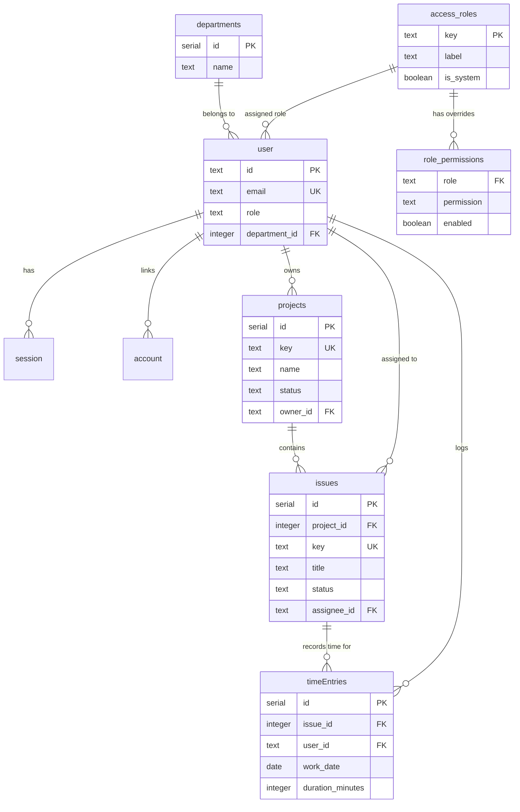

# คู่มือฐานข้อมูลและ Drizzle ORM (Database Guide)

คู่มือฉบับนี้อธิบายโครงสร้างฐานข้อมูล การออกแบบตาราง ความสัมพันธ์ (Relationships) และกระบวนการทำงานของ **Drizzle ORM** ร่วมกับ **PostgreSQL** ในโปรเจกต์ `jobs-analysis`

---

## 1. ภาพรวม Database Stack

- **RDBMS:** PostgreSQL 16 (รันผ่าน Docker Compose)
- **ORM:** Drizzle ORM (`drizzle-orm` + `postgres.js`)
- **Schema Location:** [`src/db/schema.ts`](file:///Users/sh0ckpro/Works/Freelance/Bun/jobs-analysis/src/db/schema.ts)
- **Client Factory:** [`src/db/client.server.ts`](file:///Users/sh0ckpro/Works/Freelance/Bun/jobs-analysis/src/db/client.server.ts)
- **Migration Tool:** `drizzle-kit`



---

## 2. ตารางหลักใน Schema ([`src/db/schema.ts`](file:///Users/sh0ckpro/Works/Freelance/Bun/jobs-analysis/src/db/schema.ts))

### 1. กลุ่มตาราง Authentication & Organization

- **`access_roles`:** role catalog ของระบบ เก็บทั้ง built-in role และ custom role ที่ admin สร้างจาก Access management
- **`role_permissions`:** เก็บ permission override ต่อ role; ถ้าไม่มี row จะ fallback ไปยัง default ใน `src/lib/rbac.ts`
- **`departments`:** แผนกภายในองค์กร ใช้จำกัดขอบเขตการมอบหมายงาน (Assign) แทนกันของสมาชิก
- **`user`:** ผู้ใช้งานระบบ เก็บ `role` ที่อ้างถึง `access_roles.key` และ `departmentId`
- **`session`:** ข้อมูล session ปัจจุบันของ Better Auth (ผูกกับ cookie token)
- **`account` & `verification`:** ตารางสำหรับ provider login และ token ยืนยันอีเมล

### 2. กลุ่มตาราง Project Management & Work Hours

- **`projects`:** โปรเจกต์หลัก
  - `key`: รหัสย่อ เช่น `PROJ`, `DEV` (ต้องเป็นตัวพิมพ์ใหญ่ 2-10 ตัวอักษร)
  - `status`: `'active'` หรือ `'archived'` (โปรเจกต์ที่ archived จะไม่อนุญาตให้สร้างงานหรือ log เวลาเพิ่ม)
  - `ownerId`: ผู้รับผิดชอบโปรเจกต์ (Manager หรือ Admin)
- **`issues`:** งานย่อยในแต่ละโปรเจกต์
  - `key`: รหัสงาน เช่น `PROJ-1`, `PROJ-2` (คำนวณอัตโนมัติตาม project key)
  - `status`: `'todo'`, `'in_progress'`, `'done'`, `'canceled'`
  - `estimatedMinutes`: เวลาที่ประเมินไว้
- **`timeEntries`:** บันทึกการทำงานจริง (Worklog)
  - `workDate`: วันที่ทำงาน (รูปแบบ `YYYY-MM-DD`)
  - `durationMinutes`: จำนวนนาทีที่ลงบันทึก
  - `startedAt` & `endedAt`: ช่วงเวลาในกรณีที่เปิด Timer จับเวลาสด

---

## 3. การเชื่อมต่อแบบ Lazy Singleton ([`src/db/client.server.ts`](file:///Users/sh0ckpro/Works/Freelance/Bun/jobs-analysis/src/db/client.server.ts))

Client ถูกออกแบบเป็น Lazy Singleton เพื่อไม่ให้โปรเจกต์พังเมื่อไม่มี `DATABASE_URL` ในโหมดทดสอบ:

```tsx
import { drizzle } from 'drizzle-orm/postgres-js'
import type { PostgresJsDatabase } from 'drizzle-orm/postgres-js'
import postgres from 'postgres'
import * as schema from './schema'

let _db: PostgresJsDatabase<typeof schema> | null = null

export function getDb(): PostgresJsDatabase<typeof schema> | null {
  const url = process.env.DATABASE_URL
  if (!url) return null
  if (!_db) {
    _db = drizzle(postgres(url), { schema })
  }
  return _db
}
```

> [!CAUTION]
> ห้าม import `getDb` หรือ `client.server.ts` เข้าไปในไฟล์ route หรือคอมโพเนนต์ฝั่งหน้าบ้านเด็ดขาด เพราะจะทำให้โค้ดฝั่ง Node/Bun และ Database Connection ถูกดึงเข้าไปใน Client Bundle

---

## 4. วงจรการพัฒนาและการจัดการ Schema (Workflow)

### 1. เริ่มต้น Container ของ PostgreSQL

```bash
docker compose up -d
```

### 2. แก้ไขตารางใน `src/db/schema.ts` แล้วสร้างไฟล์ Migration

เมื่อมีการเพิ่มตารางหรือเปลี่ยนคอลัมน์ ให้รัน:

```bash
bun run db:generate
```

Drizzle Kit จะสร้างไฟล์ SQL migration ใหม่ลงในโฟลเดอร์ `drizzle/`

### 3. นำ Migration เข้าสู่ฐานข้อมูล

```bash
bun run db:migrate
```

### 4. ใส่ข้อมูลเริ่มต้น (Seed Data)

คำสั่งนี้จะล้างข้อมูลเดิมและสร้างบัญชี Demo 3 บทบาทพร้อมข้อมูลงานตัวอย่าง:

```bash
bun run db:seed
```

### บัญชี Demo เริ่มต้น (รหัสผ่านทั้งหมดคือ `password123`):

- Admin: `admin@pm.local`
- Manager: `manager@pm.local`
- Member: `member@pm.local`

### 5. ตรวจสอบข้อมูลผ่าน GUI (Drizzle Studio)

```bash
bun run db:studio
```

เปิดเบราว์เซอร์เพื่อดูและแก้ไขข้อมูลในตารางผ่าน Web Interface ได้ทันที

---

## 5. ตัวอย่างการ Query ด้วย Drizzle ORM

### ตัวอย่างที่ 1: Select พร้อม Join และ Aggregate ผลรวมนาที

```tsx
import { eq, sum } from 'drizzle-orm'
import { getDb } from '@/db/client.server'
import { projects, timeEntries, issues } from '@/db/schema'

export async function getProjectStats(projectId: number) {
  const db = getDb()!

  const [stats] = await db
    .select({
      totalMinutes: sum(timeEntries.durationMinutes).mapWith(Number),
    })
    .from(timeEntries)
    .innerJoin(issues, eq(timeEntries.issueId, issues.id))
    .where(eq(issues.projectId, projectId))

  return { totalMinutes: stats?.totalMinutes ?? 0 }
}
```

### ตัวอย่างที่ 2: Transaction และ Insert พร้อมคืนค่าแถวใหม่ (`returning`)

```tsx
export async function createIssueWithLog(
  projectId: number,
  title: string,
  userId: string,
) {
  const db = getDb()!

  return await db.transaction(async (tx) => {
    // 1. สร้าง Issue
    const [issue] = await tx
      .insert(issues)
      .values({
        projectId,
        title,
        status: 'todo',
        assigneeId: userId,
      })
      .returning()

    // 2. บันทึก Time Entry แรกทันที
    await tx.insert(timeEntries).values({
      issueId: issue.id,
      userId,
      workDate: new Date().toISOString().split('T')[0],
      durationMinutes: 15,
      description: 'Initial planning',
    })

    return issue
  })
}
```

---

## 6. การแก้ปัญหาที่พบบ่อย (Troubleshooting)

### ปัญหา: รัน `bun run db:migrate` แล้วตารางไม่ถูกสร้าง

- **สาเหตุ:** อาจมี Journal เก่าตกค้างอยู่ใน PostgreSQL ใน schema `drizzle` ทำให้ migration คิดว่าถูกรันไปแล้ว
- **วิธีแก้:** เข้า PostgreSQL แล้วสั่ง `DROP SCHEMA drizzle CASCADE;` จากนั้นรัน `bun run db:migrate` ใหม่อีกครั้ง
