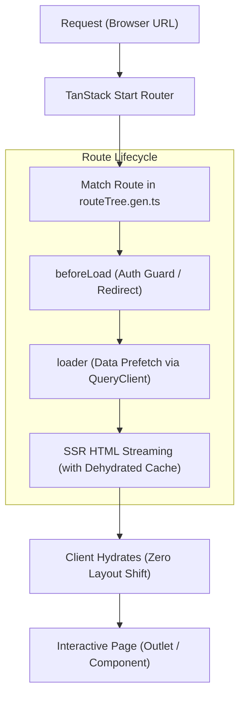

# คู่มือการทำงานของ TanStack Start Router

คู่มือฉบับนี้อธิบายระบบ Routing ของ TanStack Start ที่ใช้งานในโปรเจกต์ `jobs-analysis` แบบเจาะลึก ตั้งแต่แนวคิดเบื้องหลัง โครงสร้างไฟล์ กฎการตั้งชื่อ Lifecycle ของ route การผสานงานกับ SSR/TanStack Query ไปจนถึงแนวทางปฏิบัติจริงในการสร้าง route ใหม่

---

## 1. ภาพรวมและ Mental Model

TanStack Start ใช้ **TanStack Router** เป็นหัวใจหลักในการจัดการเส้นทาง (Routing) โดยทำงานบน Vite และ Bun ระบบ routing ที่นี่มีจุดเด่นสำคัญ 3 เรื่อง:

1. **Full-stack File-based Routing:** โครงสร้างโฟลเดอร์และชื่อไฟล์ใน `src/routes/` จะถูกแปลงเป็น URL โดยอัตโนมัติ พร้อมรองรับทั้งหน้า UI (Client/SSR) และ Server Endpoints (API handlers) ในที่เดียว
2. **100% Type-Safe End-to-End:** ทุก route path, URL params (`$param`), query search (`?page=1`), และ loader data ถูกตรวจสอบตั้งแต่ระดับ TypeScript ถ้าพิมพ์ path ผิด หรือส่ง param ขาด ตัว compiler จะฟ้อง error ทันที
3. **SSR Query Hydration แบบไร้รอยต่อ:** ตัว router ผูกเข้ากับ TanStack Query ผ่าน `@tanstack/react-router-ssr-query` ข้อมูลที่โหลดใน `loader` จะถูก prefetch ฝั่ง server แล้ว stream เข้าสู่ HTML พร้อม hydrate ลง client cache ทันทีโดยไม่เกิด data waterfall หรือหน้ากระพริบ



---

## 2. โครงสร้างไฟล์และ Naming Conventions

TanStack Router ใช้การแปลงชื่อไฟล์ (Convention-based) เป็น route tree โดยมีไฟล์ generated อยู่ที่ [`src/routeTree.gen.ts`](file:///Users/sh0ckpro/Works/Freelance/Bun/jobs-analysis/src/routeTree.gen.ts)

> [!WARNING]
> ห้ามแก้ไขไฟล์ [`src/routeTree.gen.ts`](file:///Users/sh0ckpro/Works/Freelance/Bun/jobs-analysis/src/routeTree.gen.ts) ด้วยมือโดยเด็ดขาด หลังเพิ่ม ลบ หรือย้ายไฟล์ใน `src/routes/` ให้รัน `bun run generate-routes` เสมอ

### สรุปสัญลักษณ์ในชื่อไฟล์

| รูปแบบไฟล์                  | ความหมาย                                                         | ตัวอย่างในโปรเจกต์                        | Public URL ที่ได้       |
| :-------------------------- | :--------------------------------------------------------------- | :---------------------------------------- | :---------------------- |
| `__root.tsx`                | Root route ครอบคลุมทั้งแอป (HTML shell, fonts, global providers) | `src/routes/__root.tsx`                   | -                       |
| `index.tsx`                 | หน้า index ของโฟลเดอร์นั้น                                       | `src/routes/_app/index.tsx`               | `/`                     |
| `name.tsx`                  | หน้า static ปกติ                                                 | `src/routes/login.tsx`                    | `/login`                |
| `name.index.tsx`            | หน้า index ของกลุ่ม path (แบบ dot notation)                      | `src/routes/_app/projects.index.tsx`      | `/projects`             |
| `$param.tsx`                | Dynamic path parameter                                           | `src/routes/_app/projects.$projectId.tsx` | `/projects/:projectId`  |
| `_layout/` หรือ `_name.tsx` | **Pathless layout:** มีไว้แชร์ layout/guard แต่ไม่ปรากฏใน URL    | `src/routes/_app/route.tsx`               | ไม่เพิ่ม segment ใน URL |
| `$.ts` หรือ `$.tsx`         | Splat / Catch-all route (ดักทุก path ที่เหลือ)                   | `src/routes/api/auth/$.ts`                | `/api/auth/*`           |
| `name.test.tsx`             | ไฟล์ที่ถูกข้าม (ไม่นำมาคิดเป็น route)                            | กำหนดใน `tsr.config.json`                 | -                       |

---

### เจาะลึกแต่ละรูปแบบ

#### 1. Root Route (`src/routes/__root.tsx`)

เป็นรากฐานของหน้าเว็บทั้งหมด ทำหน้าที่:

- กำหนดโครงสร้างเอกสาร HTML (`<html>`, `<head>`, `<body>`) ผ่าน `shellComponent`
- ใส่ Meta tags, Fonts, CSS bundles ผ่านฟังก์ชัน `head`
- เป็นจุดกระจาย `<Outlet />` หลัก และดักจับหน้า Not Found ทั่วทั้งระบบ

```tsx
export const Route = createRootRouteWithContext<{
  queryClient: QueryClient
}>()({
  head: () => ({
    meta: [
      { charSet: 'utf-8' },
      { name: 'viewport', content: 'width=device-width, initial-scale=1' },
    ],
    links: [{ rel: 'stylesheet', href: appCss }],
  }),
  shellComponent: RootDocument,
  component: RootLayout,
  notFoundComponent: NotFoundPage,
})
```

#### 2. Pathless Layout (`src/routes/_app/`)

สังเกตเครื่องหมายขีดล่างนำหน้า `_app`:

- ไฟล์ [`src/routes/_app/route.tsx`](file:///Users/sh0ckpro/Works/Freelance/Bun/jobs-analysis/src/routes/_app/route.tsx) จะสร้าง layout ครอบทุกไฟล์ที่อยู่ใต้โฟลเดอร์ `_app/`
- โฟลเดอร์นี้มี Sidebar, Header, และ Auth Guard
- **URL จะไม่มี `/_app` ปรากฏ** เช่น `src/routes/_app/reports.tsx` จะได้ URL ตรง ๆ คือ `/reports`

#### 3. Flat File Routes vs Directory Routes (Dot Notation)

TanStack Router รองรับ 2 สไตล์:

1. Directory-based: `src/routes/projects/$projectId/index.tsx`
2. Flat (Dot notation): `src/routes/_app/projects.$projectId.tsx`

ในโปรเจกต์นี้เลือกใช้ **Dot notation** เป็นหลัก เพราะเห็นโครงสร้างและระดับของ URL ชัดเจนจากรายชื่อไฟล์ ไม่ต้องเปิดโฟลเดอร์ซ้อนกันหลายชั้น

#### 4. Dynamic Parameter (`$projectId`, `$issueId`)

ใช้เครื่องหมาย `$` นำหน้าชื่อตัวแปร:

- `src/routes/_app/projects.$projectId.tsx` แปลงเป็น `/projects/:projectId`
- ดึงค่ามาใช้ใน component ได้ง่ายผ่าน `Route.useParams()` พร้อม type string ตามชื่อที่ตั้งไว้

#### 5. Catch-all / Splat Route (`api/auth/$.ts`)

ใช้เครื่องหมาย `$` โดดเดี่ยวเพื่อรับ path ย่อยทั้งหมด เหมาะกับการทำ API handlers เช่น Better Auth:

- `/api/auth/sign-in/email`
- `/api/auth/session`
- `/api/auth/callback`  
  ทั้งหมดจะวิ่งเข้า `src/routes/api/auth/$.ts` ตัวเดียว

---

## 3. เจาะลึกส่วนประกอบของ Route File (Route Lifecycle)

Route file ใน TanStack Start สร้างด้วย `createFileRoute('/path')({...})` ภายในมี lifecycle methods ให้เลือกใช้ตามหน้าที่:

```tsx
import { createFileRoute, redirect } from '@tanstack/react-router'
import { z } from 'zod'

// กำหนด Schema สำหรับ Query Params
const searchSchema = z.object({
  tab: z.enum(['overview', 'activity']).default('overview'),
  page: z.number().int().positive().default(1),
})

export const Route = createFileRoute('/_app/projects/$projectId')({
  // 1. ตรวจสอบ query string (type-safe search params)
  validateSearch: (search) => searchSchema.parse(search),

  // 2. ตรวจสอบเงื่อนไขก่อนโหลด (Auth / Permission / Redirect)
  beforeLoad: async ({ context, params }) => {
    // รันทั้ง Server (SSR) และ Client (Navigation)
  },

  // 3. ดึงข้อมูลล่วงหน้า (Data Fetching / Query Prefetching)
  loader: async ({ context: { queryClient }, params, search }) => {
    // โหลดข้อมูลใส่ Cache
  },

  // 4. หน้าจอระหว่างรอโหลด (Fallback Skeleton)
  pendingComponent: ProjectSkeleton,

  // 5. จัดการกรณีเกิด Error ใน route นี้
  errorComponent: ({ error }) => <div>เกิดข้อผิดพลาด: {error.message}</div>,

  // 6. UI หลักของหน้า
  component: ProjectDetailPage,
})
```

### รายละเอียด Lifecycle แต่ละตัว

### 1. `beforeLoad` (Auth Guard & Context)

ทำงานก่อน `loader` เสมอ เหมาะสำหรับ:

- ตรวจสอบ Session หากยังไม่ล็อกอิน ให้สั่ง `throw redirect({ to: '/login' })`
- ส่งค่าเข้าสู่ Route Context เพื่อให้ `loader` หรือ child route ใช้งานต่อ

ตัวอย่างจาก [`src/routes/_app/route.tsx`](file:///Users/sh0ckpro/Works/Freelance/Bun/jobs-analysis/src/routes/_app/route.tsx):

```tsx
export const Route = createFileRoute('/_app')({
  beforeLoad: async () => {
    const session = await getSession()
    if (!session) {
      throw redirect({ to: '/login' })
    }
  },
  component: AppLayout,
})
```

### 2. `loader` (Data Prefetching กับ TanStack Query)

ใน TanStack Start เราไม่ดึงข้อมูลสดใน `useEffect` แบบดั้งเดิม แต่ใช้ `loader` ดึงข้อมูลผ่าน `queryClient`:

- ตอนทำ SSR ฝั่ง server จะรอ `loader` เสร็จ เพื่อเอาข้อมูลลง HTML
- ตอนย้ายหน้าฝั่ง client หากผู้ใช้เอาเมาส์ไปชี้ลิงก์ (Hover) ตัว router จะรัน prefetch ล่วงหน้าทันที

ตัวอย่างจาก [`src/routes/_app/projects.$projectId.tsx`](file:///Users/sh0ckpro/Works/Freelance/Bun/jobs-analysis/src/routes/_app/projects.$projectId.tsx):

```tsx
export const Route = createFileRoute('/_app/projects/$projectId')({
  loader: ({ context: { queryClient }, params: { projectId } }) => {
    const pid = Number(projectId)
    return Promise.all([
      queryClient.query({
        staleTime: 'static',
        queryKey: queryKeys.projects,
        queryFn: () => getProjects(),
      }),
      queryClient.query({
        staleTime: 'static',
        queryKey: queryKeys.projectIssues(pid),
        queryFn: () => listIssues({ data: { projectId: pid, limit: 100 } }),
      }),
    ])
  },
  pendingComponent: RouteSkeleton,
  component: RouteComponent,
})
```

### 3. `pendingComponent` และ `defaultPendingMs`

ถ้า `loader` ทำงานเสร็จไว (ต่ำกว่าเกณฑ์ `defaultPendingMs: 400`) ผู้ใช้จะไม่เห็นกระพริบของ skeleton เลย แต่หาก network ช้าเกิน 400ms ตัว `pendingComponent` จะโผล่ขึ้นมาแทนที่แบบเนียน ๆ ทันที

### 4. `server.handlers` (API Endpoint Route)

ถ้าเป็น route สำหรับ backend API ไม่ต้องมี `component` แต่ให้ใช้ property `server.handlers`:

ตัวอย่างจาก [`src/routes/api/auth/$.ts`](file:///Users/sh0ckpro/Works/Freelance/Bun/jobs-analysis/src/routes/api/auth/$.ts):

```tsx
export const Route = createFileRoute('/api/auth/$')({
  server: {
    handlers: {
      GET: async ({ request }: { request: Request }) => auth.handler(request),
      POST: async ({ request }: { request: Request }) => auth.handler(request),
    },
  },
})
```

---

## 4. การตั้งค่า Router หลัก (`src/router.tsx`)

Router กลางถูกตั้งค่าไว้ที่ [`src/router.tsx`](file:///Users/sh0ckpro/Works/Freelance/Bun/jobs-analysis/src/router.tsx):

```tsx
import { QueryClient } from '@tanstack/react-query'
import { createRouter as createTanStackRouter } from '@tanstack/react-router'
import { setupRouterSsrQueryIntegration } from '@tanstack/react-router-ssr-query'
import { routeTree } from './routeTree.gen'

export function getRouter() {
  const queryClient = new QueryClient({
    defaultOptions: {
      queries: {
        staleTime: 30_000,
      },
    },
  })

  const router = createTanStackRouter({
    routeTree,
    context: { queryClient },
    scrollRestoration: true,
    defaultPreload: 'intent',
    defaultPreloadStaleTime: 0,
    defaultPendingMs: 400,
    defaultViewTransition: true,
  })

  // เชื่อม SSR Query Cache เข้ากับ Router Stream อัตโนมัติ
  setupRouterSsrQueryIntegration({ router, queryClient })

  return router
}

// ผูก Type ให้กับ library TanStack Router ทั้งระบบ
declare module '@tanstack/react-router' {
  interface Register {
    router: ReturnType<typeof getRouter>
  }
}
```

### อธิบายการตั้งค่าสำคัญ

- `context: { queryClient }`: ส่ง queryClient เข้าไปใน router context เพื่อให้ทุก route เรียกใช้ใน `loader` ได้โดยตรง
- `defaultPreload: 'intent'`: พอผู้ใช้เลื่อนเมาส์ไปแตะ (hover) หรือกด focus ที่ปุ่ม `<Link>` ข้อมูลของหน้านั้นจะถูกโหลดมาเตรียมไว้ล่วงหน้าทันที ทำให้กดแล้วหน้าเปลี่ยนแบบแทบไม่ต้องรอ
- `defaultViewTransition: true`: ใช้ Native Browser View Transitions API เมื่อเปลี่ยนหน้า ตัว browser จะทำ animation cross-fade หรือ morph transition ให้อัตโนมัติ
- `setupRouterSsrQueryIntegration`: ตัวเชื่อมระหว่าง TanStack Query กับ TanStack Start SSR สตรีม query cache ฝั่ง server ส่งไป client ได้โดยไม่ต้องเขียน `<HydrationBoundary>` ซ้ำซ้อน

---

## 5. การนำทางและ Navigation Hooks

### 1. ลิงก์ด้วยคอมโพเนนต์ `<Link>`

ห้ามใช้แท็ก `<a href="...">` สำหรับ internal routing เพราะจะทำให้หน้าเว็บรีโหลดทั้งหน้า ให้ใช้ `<Link>` จาก `@tanstack/react-router`:

```tsx
import { Link } from '@tanstack/react-router'

// 1. Static Link ทั่วไป
<Link to="/reports" className="hover:underline">
  Reports
</Link>

// 2. Link พร้อม Dynamic Params (มี Type Checking ตรวจสอบชื่อ param)
<Link
  to="/projects/$projectId"
  params={{ projectId: String(project.id) }}
  className="font-semibold"
>
  {project.name}
</Link>

// 3. Link พร้อม Search Query String
<Link
  to="/reports"
  search={{ range: '1M' }}
  activeProps={{ className: 'text-primary font-bold' }}
>
  รายงานเดือนนี้
</Link>
```

### 2. นำทางผ่านโค้ดด้วย `useNavigate()`

```tsx
import { useNavigate } from '@tanstack/react-router'

function CreateProjectDialog() {
  const navigate = useNavigate()

  async function handleSuccess(newProjectId: number) {
    await navigate({
      to: '/projects/$projectId',
      params: { projectId: String(newProjectId) },
    })
  }
}
```

### 3. ดึงค่า Params และ Search ใน Component

ใช้ hook จากตัวแปร `Route` ประจำหน้านั้นเพื่อความแม่นยำของ type สูงสุด:

```tsx
// ในไฟล์ src/routes/_app/projects.$projectId.tsx
function RouteComponent() {
  // ได้ type { projectId: string } อัตโนมัติ
  const { projectId } = Route.useParams()
  return <ProjectDetailPage projectId={projectId} />
}
```

---

## 6. กฎสำคัญเรื่อง Server Boundary และ Thin Route

นี่คือกฎทางสถาปัตยกรรมที่สำคัญที่สุดในโปรเจกต์นี้:

> [!IMPORTANT]
> **Route files ต้องบาง (Thin Route Convention):**
>
> 1. ไฟล์ route ใน `src/routes/` มีหน้าที่เพียงผูก URL เข้ากับ feature page เท่านั้น
> 2. **ห้าม** เขียน DB query, Drizzle query, หรือ business logic ในไฟล์ route
> 3. **ห้าม** import `src/db/client.server.ts` หรือไฟล์ `*.server.ts` เข้ามาในไฟล์ route หรือ client components เด็ดขาด เพราะจะทำให้ node/server code หลุดเข้าไปใน client bundle ส่งผลให้ build พังทันที

### การแบ่งเลเยอร์ตามสถาปัตยกรรม:

```text
src/routes/_app/projects.index.tsx (Thin Route Entrypoint)
       │
       ▼ เรียกใช้ Server Function ผ่าน Loader
src/features/projects/projects.functions.ts (createServerFn Wrapper)
       │
       ▼ รันเฉพาะฝั่ง Server
src/features/projects/projects.server.ts (Business Logic / DB Access)
       │
       ▼ ติดต่อ Database
src/db/client.server.ts -> PostgreSQL
```

- **`*.functions.ts`**: ใช้ `createServerFn` สร้างจุดเชื่อมต่อข้ามฝั่ง ปลอดภัยในการ import จากไฟล์ route
- **`*.server.ts`**: โค้ดที่รันบน server จริง (มี session check, role check, drizzle query)
- **`*.schema.ts`**: Zod schema และ TypeScript types ที่แชร์ได้ทั้ง client และ server

---

## 7. ขั้นตอนปฏิบัติจริง: การสร้าง Route ใหม่ (Step-by-Step)

สมมติว่าต้องการสร้างหน้าใหม่ชื่อ **"Audit Logs"** ที่ URL `/audit-logs` ภายใต้ layout หลัก:

### ขั้นตอนที่ 1: สร้าง Feature Page และ Logic

สร้างหน้า UI ไว้ใต้ `src/features/audit-logs/`:

- `src/features/audit-logs/audit-logs-page.tsx`
- `src/features/audit-logs/audit-logs.functions.ts` (ถ้ามี server data)
- `src/features/audit-logs/audit-logs.server.ts`
- `src/features/audit-logs/audit-logs.schema.ts`

### ขั้นตอนที่ 2: สร้าง Route Entrypoint

สร้างไฟล์ที่ `src/routes/_app/audit-logs.tsx`:

```tsx
import { createFileRoute } from '@tanstack/react-router'
import { AuditLogsPage } from '@/features/audit-logs/audit-logs-page'
import { RouteSkeleton } from '@/components/layout/route-skeleton'
import { queryKeys } from '@/lib/query-keys'
import { getAuditLogs } from '@/features/audit-logs/audit-logs.functions'

export const Route = createFileRoute('/_app/audit-logs')({
  loader: ({ context: { queryClient } }) =>
    queryClient.query({
      staleTime: 'static',
      queryKey: ['pm', 'audit-logs'],
      queryFn: () => getAuditLogs(),
    }),
  pendingComponent: RouteSkeleton,
  component: AuditLogsPage,
})
```

### ขั้นตอนที่ 3: สั่งสร้าง Route Tree ใหม่

รันคำสั่ง:

```bash
bun run generate-routes
```

คำสั่งนี้จะอัปเดตไฟล์ [`src/routeTree.gen.ts`](file:///Users/sh0ckpro/Works/Freelance/Bun/jobs-analysis/src/routeTree.gen.ts) ให้รู้จัก path `/_app/audit-logs` และเปิดให้ `<Link to="/audit-logs">` มี type autocomplete ทันที

### ขั้นตอนที่ 4: ตรวจสอบความถูกต้อง (Verification)

1. ตรวจสอบ TypeScript: `bunx tsc --noEmit`
2. ตรวจสอบ Lint: `bunx eslint src/routes/_app/audit-logs.tsx`
3. ทดสอบเปิด URL ตรง ๆ: `http://localhost:3000/audit-logs`
4. ทดสอบกดลิงก์นำทางจากหน้าอื่น (Client-side navigation)

---

## 8. ปัญหาที่พบบ่อยและวิธีแก้ (Troubleshooting)

### 1. เพิ่มไฟล์ route แล้วเปิดหน้าเว็บแล้วขึ้น 404 หรือ TypeScript แจ้งว่า route ไม่มีอยู่จริง

- **สาเหตุ:** ยังไม่ได้ generate route tree หรือ dev server cache ไว้
- **วิธีแก้:** รัน `bun run generate-routes` แล้วรีสตาร์ต dev server ด้วย `bun --bun run dev`

### 2. เกิด Error: `Module not found` หรือ `Cannot bundle node:* in client`

- **สาเหตุ:** มีการเผลอ import `*.server.ts` หรือ `src/db/client.server.ts` เข้ามาใน route file หรือ feature UI component โดยตรง
- **วิธีแก้:** ย้าย data access ไปไว้ใน server function ผ่าน `*.functions.ts` (`createServerFn`) เท่านั้น

### 3. URL มี segment แปลกปลอมโผล่ขึ้นมา เช่น `/_app/...`

- **สาเหตุ:** ตั้งชื่อโฟลเดอร์หรือไฟล์ layout ผิด โดยลืมใส่เครื่องหมาย `_` ข้างหน้า
- **วิธีแก้:** ให้ใช้ `_app` (มี underscore) เพื่อกำหนดให้เป็น Pathless Layout

### 4. หน้าเว็บกระตุกหรือ Skeleton กระพริบวาบเร็วเกินไป

- **สาเหตุ:** การตั้งค่า `defaultPendingMs` สั้นเกินไป
- **วิธีแก้:** ในโปรเจกต์นี้ตั้งไว้ที่ `defaultPendingMs: 400` หากข้อมูลตอบกลับมาเร็วกว่า 400ms ตัว router จะข้ามการแสดง skeleton ไปเลยเพื่อไม่ให้รบกวนสายตาผู้ใช้
